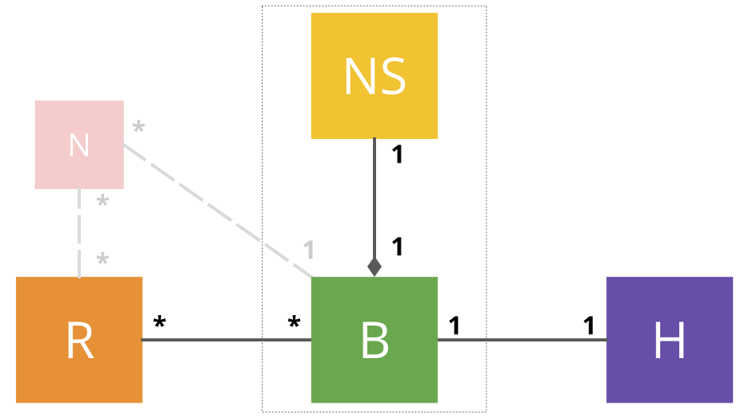

Broker
======

## Role

Brokers constitute the heart of the network. They hold the logic that makes every other
component work together (routers, network servers and handlers). They play a role of mediator,
making sure that packets are correct and handling communications between other components. To
each broker is associated a given network server with which it is working closely. We can see
the network server as external ressources of computing and storage to which a broker could
refer at any time. 

Therefore, a broker is in charge of a set of nodes. This is a 1-to-1 relation meaning that a
node is controlled by a unique broker. There is for the moment no duplication or sharing
possible. A broker does not have access to network servers different from the one it has been
assigned. A node isn't shared and all packets coming from a given node end up in the same broker.

Besides, a broker does not know any router in advance. The process is basically similar to the way
gateways and routers discover each other. A router will initiate a communication
with a broker. After dealing with the communication, the broker may reply to the router and
will forget about its existence. Brokers are known from routers, like routers are
known from gateways. 

On the other hand, brokers communicate with a bunch of handlers that have registered themselves
beforehand. This way, when a end-device joins the network every broker has to communicate with its
own handlers list to determine whether or not it has to handle packets incoming from that
device. The previous assertion assumes that a given handler isn't registered to several
 brokers. 

Relations are schematically represented in the next diagram. 

--------------------- 

<p align="center">*Broker's relations*</p>
-------------------

For each node it is in charge of, the broker holds a network session key associated to the node.
It is thereby able to check the integrity of the packet by doing a `MIC check`. The process is
detailed in the [LoRaWAN specifications][lorawan] - section 4.4 Message Integrity Code (MIC). 

Depending of the packet's nature, the broker might communicate with either its network server
or a registered handler. Part of the packet's message contains a *MAC header* `MHDR` which is
not encrypted and gives details about the packet's nature (cf the [payload
cheatsheet](/img/cheatsheet.svg)). Thus, for any command (`FPort` set to `0`) the broker would
forward the action to its network server. Otherwise, the packet is forwarded to the right
handler. 

### Uplink transmissions


The broker is waiting for router to forward packets coming from nodes. When receiving a packet,
the broker should firstly check whether or not it should take care of the packet. This is done
by looking into a local storage of node addresses. This is list of addresses is created
dynamically during the broker's lifecycle as long as handlers register to the broker. 
Then, because collisions may happen between node adresses, the broker also has to perform a
`MIC check` to ensure both the validity and its responsibility for the given packet. 

An unknown address or a invalid `MIC check` should lead to an error transmitted to the router
emitter. Errors are detailed in a next section. If everything went well, the broker has to
decode the packet `MAC header - MHDR` and determine whether the packet carry a command or data.
The broker's behavior is thereby slightly different regarding to the packet's content. By the
by, a packet may contain both a command and data, in such a case, it will be processed for both
content. 

**Packet with commands**

> For any received command, the broker will forward the packet to the network server able to
> deal with the command. A command is completely invisible to the application (and thus,
> handlers). By the by, when forwarding a command to a network server, the broker might wait
> for an answer until a timeout delay is reached (after the second receive window is missed for
> instance).

**Packet with data**

> When the packet is carrying data towards an application, it should be forwarded to the right
> handler. In a similar way of what is done with commands, the broker will also wait for an
> answer to reply to the router.  In the meantime, a broker will notify its network server that
> a receive window for the given device is available. The network server should either reply by
> a command to send back, or deny the offer. 

**Join request**

> A special edge-case requires an additional behavior. Join request might be sent from a
> device, in which case, the handler has to be contacted as a referee in order to authorize or
> reject the willing node. In case of success, the network server should be notified in order
> to setup and initialize the node managing in the future. 


--------------------- 

<p align="center">*Broker dispatching*</p>
-------------------

### Downlink communication

Once all required tenants have replied, the broker has to merge the response into one single
packet and send it back to the router (if necessary, it could happen that the request does not
need any packet to be sent as answer). 

## Interfaces

In order to communicate with other components, a broker will be split in four parts:

- The core broker
- The router adapter
- The handler adapter
- The network server adapter

The idea is to avoid to tightly couple the broker core features with the way it is
communicating. By doing such a separation of concerns, we allow the broker to evolve and change
its communication protocols at any moment without any impact on the core mechanisms. Thus, as
long as the adapters remain compliant to a given interface, they can be switched on demand. 

We previously identified the communication needs between the broker and other components.
Incidentally, all adapters and the core broker are sharing a same packet structure (see
[Common](/common) for more details).

### The router adapter

We consider the following methods for the Router adapter (hereby known as `RoutAdapter`):

```haskell
-- Reject a packet previously received by the broker
reject :: RoutAdapter, Packet -> Unit

-- Notify routers that the given packet has been received and is handled
ack :: RoutAdapter, Packet -> Unit 

-- Send a packet as response to a router
forward :: RoutAdapter, Packet -> Unit
```

### The handler adapter

We consider the following methods for the Handler adapter (hereby known as `HandAdapter`):

```haskell
--  Forward a join request to the handler
join :: HandAdapter, HandAddr, Packet -> Unit 

-- Forward data to the handler
forward :: HandAdapter, HandAddr, Packet -> Unit
```

### The network server adapter

We consider the following methods for the Network Server adapter (hereby known as `NSAdapter`):

```haskell
-- Forward a command to the Network Server. 
command :: NSAdapter, Packet -> Command
```

### The core broker

We consider the following methods for the Core Broker (hereby kown as `Broker`): 

```haskell
-- Handle an error thrown by an adapter
handleError :: Broker, Error -> Unit

-- Handle an incoming packet from the router
handleUplink :: Broker, Packet -> Unit

-- Handle an incoming packet from the handler
handleData :: Broker, DevAddr, Data -> Unit

-- Handle an incoming command from the Network Server
HandleCommand :: Broker, DevAddr, Command -> Unit

-- Receive and store a network session key associated to a device
HandleNwkSKey :: Broker, DevAdrr, NwkSKey -> Unit

```

## Flow Chart

//TODO


[lorawan]: https://www.lora-alliance.org/portals/0/specs/LoRaWAN%20Specification%201R0.pdf
